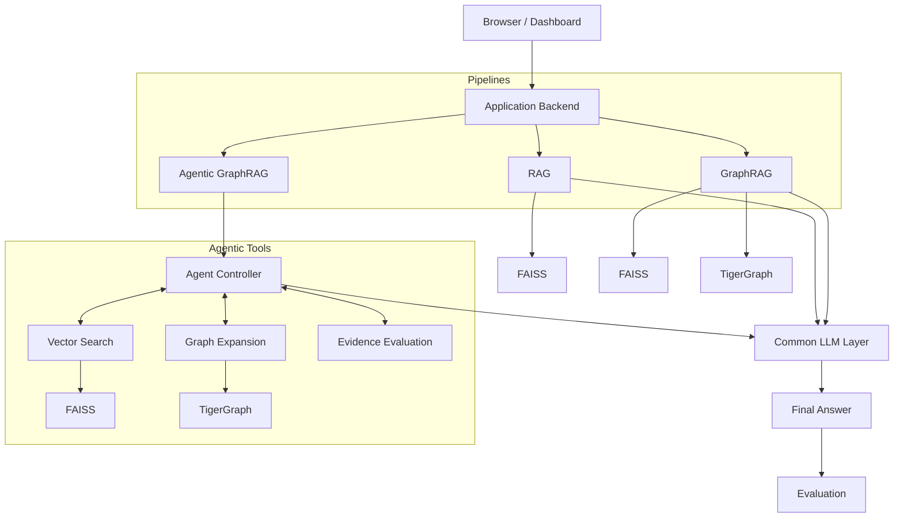

# Architecture

This document details the architectural components of the RAG vs GraphRAG vs Agentic GraphRAG system.

## System Diagram

## Component Responsibilities

- **Dashboard**: The frontend interface for triggering pipelines, viewing real-time latency/token telemetry, and displaying side-by-side evaluations.
- **Pipeline Layer**: Orchestrates the high-level execution of the RAG, GraphRAG, and Agentic GraphRAG strategies.
- **Retrieval Layer**: Contains the logic for embedding queries, looking up neighbors, and querying TigerGraph.
- **FAISS Vector Store**: Stores dense vectors (via `nomic-embed-text`) of document chunks for semantic similarity search.
- **TigerGraph**: The core graph database (TigerGraph Savanna 4.2.5) serving structural relationships between Documents, Chunks, and Entities.
- **LLM Abstraction**: A unified provider interface wrapping local Ollama, ensuring consistent prompt handling and telemetry tracking.
- **Agent Controller**: The autonomous loop in the Agentic pipeline that decides whether to search, expand, evaluate, or stop.
- **Evidence Selection**: A local embedding reranking tool that distills large candidate chunk lists down to the most relevant facts.
- **Evidence Evaluation**: An LLM-driven tool that inspects currently collected evidence to determine factual sufficiency relative to the user's question.
- **Benchmark Runner**: A dedicated CLI tool that evaluates large suites of questions across all three pipelines, producing detailed JSONL trace artifacts.
- **Metrics/Telemetry**: Pervasive tracking of total tokens, evaluation tokens, prompt tokens, wall-clock latency, and step counts.

## Security Boundaries

The system strictly enforces the following boundary:
`Browser → Backend → Provider/TigerGraph`

The browser serves as a thin presentation layer. It **must never** receive TigerGraph secrets, provider API keys, or raw chain-of-thought traces. All LLM calls and graph queries are resolved entirely server-side.

*Note: Local Ollama is the default development configuration, ensuring no data leaves the local machine during standard development.*
