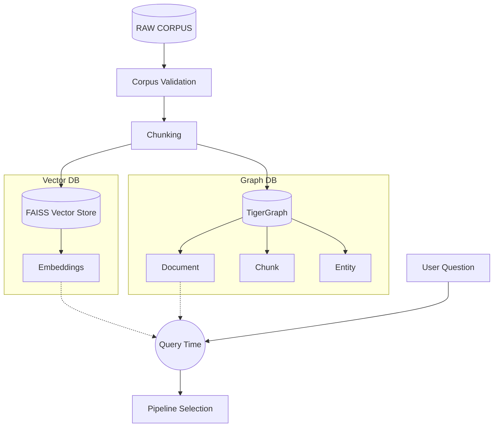
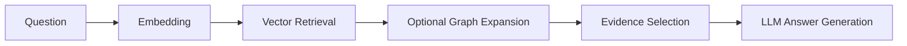
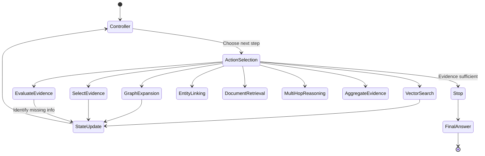

# Data Flow

This document visualizes the lifecycle of data from raw corpus ingestion to query-time evaluation.

## End-to-End Lifecycle

## Ingestion Flow
1. **Corpus:** 2,951 source documents are loaded.
2. **Validation:** Checks for data integrity and parses text.
3. **Chunking:** Documents are split into 13,130 context-aware chunks.
4. **TigerGraph Loading:** Documents, Chunks, and extracted Entities are loaded into the TigerGraph schema as vertices and edges.
5. **Embedding Generation:** Chunks are embedded using `nomic-embed-text`.
6. **FAISS Index:** Embeddings are persisted in a local FAISS index for fast semantic lookup.

## Query Flow (Standard & GraphRAG)

For standard RAG, the Graph Expansion step is bypassed. For GraphRAG, vector-retrieved documents serve as "seed documents" to traverse relationships in TigerGraph.

## Agentic Flow

Agentic GraphRAG is not simply "RAG + a graph." It introduces an adaptive investigation loop.

Rather than a single pass, the controller iteratively acts based on its understanding of `missing_information`. It uses a rigid stop guard that blocks premature stops if the evaluation determines the current evidence is insufficient.
